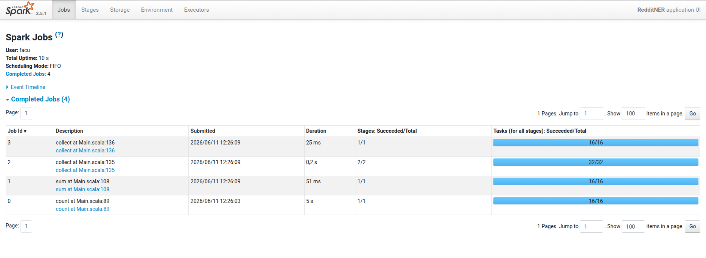
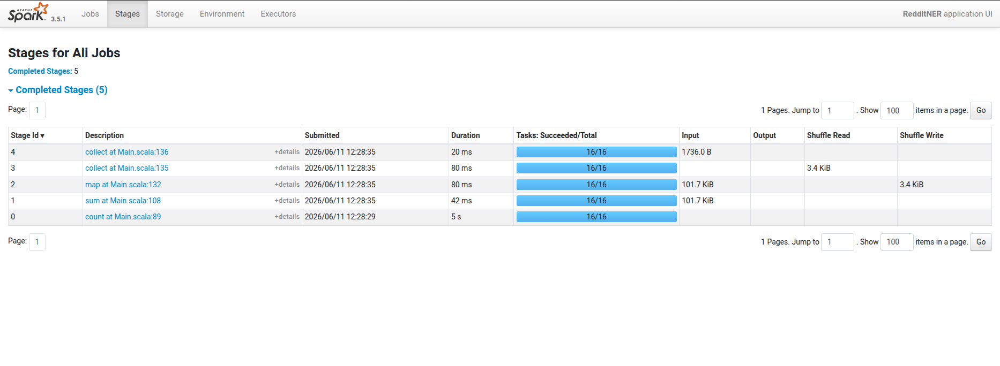
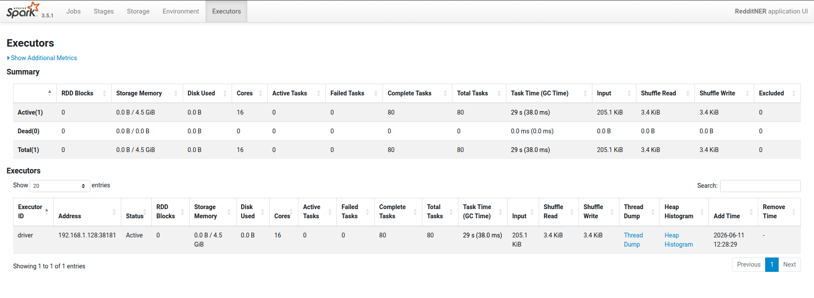

# Informe - Laboratorio 3

## Ejercicio 1 — Identificar las regiones paralelizables

### 1.a - Dibujar diagrama de flujo con los pasos que debe realizar el programa

```
[Driver] Leer JSON y paralelizar (sc.parallelize)
   |
   | ---> Tipo de conexión: RDD[Subscription]
   v
[Workers] Descargar feeds y extraer posts (flatMap)
   |
   | ---> Tipo de conexión: RDD[Post]
   v
[Workers] Extraer entidades nombradas (flatMap)
   |
   | ---> Tipo de conexión: RDD[NamedEntity]
   v
[Workers] Clasificar y preparar pares clave-valor (map)
   |
   | ---> Tipo de conexión: RDD[((String, String), Int)]
   v
[Workers] Contar apariciones sumando valores (reduceByKey)
   |
   | ---> Tipo de conexión: RDD[((String, String), Int)]
   v
[Workers] Ordenar resultados por conteo y tipo (sortBy)
   |
   | ---> Tipo de conexión: RDD[((String, String), Int)]
   v
[Driver] Recolectar resultados (collect) e imprimir
   |
   | ---> Tipo final en memoria: Array[((String, String), Int)]
```

### 1.b

Descarga de feeds y extracción de posts: Corresponde a flatMap. La justificación es que una sola URL de suscripción puede generar múltiples posts, o incluso cero si la descarga falla o si los posts se filtran por estar vacíos.
  
Extracción de entidades nombradas: Corresponde a flatMap. De un solo post pueden salir varias namedEntity, o ninguna si el diccionario no detecta coincidencias relevantes.  

Clasificación y preparación de pares clave-valor: Corresponde a map. Cada entidad extraída se transforma independientemente en exactamente un par de la forma ((tipo, nombre), 1).  

Conteo de apariciones: Corresponde a reduceByKey. Combina múltiples elementos distribuidos agrupando todas las tuplas que tienen la misma clave (la misma entidad) para sumar sus valores y dejar un solo resultado por entidad.  

¿Hay pasos que no encajen en estas abstracciones?

Sí, en el pipeline de dependencias hay pasos que no encajan ni en map, ni flatMap, ni reduceByKey:  

La recolección de resultados (collect): Las abstracciones como map o flatMap son transformaciones que crean un nuevo RDD de forma perezosa. En cambio, collect y las impresiones por pantalla son acciones terminales. Estas no transforman los datos de forma distribuida, sino que fuerzan la ejecución del pipeline y traen los datos desde los workers de vuelta a la memoria del driver.

La inicialización (sc.parallelize): No transforma un RDD existente, sino que es la operación de origen que toma una colección local del driver y la inyecta al sistema distribuido.

El ordenamiento global (sortBy): Aunque es una transformación, tiene una lógica distinta. No procesa elementos de forma totalmente independiente (map) ni agrupa estrictamente para reducir un valor (reduceByKey), sino que requiere intercambiar datos por toda la red para establecer un orden total de mayor a menor aparición.

### 1.c

Pasos completamente independientes: La descarga de feeds (flatMap), la extracción de entidades (flatMap) y la clasificación (map) se ejecutan de manera "vergonzosamente paralela". Cada worker agarra un post, lo procesa y escupe un resultado sin importarle qué están haciendo los demás workers ni necesitar comunicarse con ellos.

Barreras de sincronización: El punto de quiebre es el reduceByKey. Constituye una barrera porque Spark necesita agrupar los datos por clave a través de toda la red, un proceso conocido como shuffle. Ningún worker puede emitir el resultado final del conteo para una entidad específica hasta que todos los workers del clúster hayan terminado sus etapas de map y hayan enviado sus conteos parciales. El ordenamiento final (sortBy) también actúa como barrera por el mismo motivo: necesitás ver todos los datos para ordenarlos globalmente.  

### 1.d

Serialización: Las funciones (y cualquier objeto o variable que referencien de su entorno exterior) tienen que ser serializables. Si se referencia un objeto que no puede convertirse a bytes para viajar por la red, Spark va a tirar una excepción antes de arrancar.

Estado Compartido: En un clúster no hay memoria física compartida como ocurre con los hilos locales de un sistema operativo. Si la función intenta modificar una variable global normal, cada worker va a modificar su propia copia local aislada y los resultados se van a perder. Para compartir estado o recolectar métricas se deben usar mecanismos específicos como los Accumulators.

Efectos Secundarios: Las funciones deben ser puras en lo posible. Spark provee tolerancia a fallos reejecutando tareas que se caen. Si tu función tiene efectos secundarios (por ejemplo, hace un insert directo a una base de datos externa), una caída del worker y su posterior reejecución podría causar que se inserten datos duplicados o que el estado quede corrupto.

## Ejercicio 2 — Paralelizar la descarga de feeds

### ¿Qué pasaría si dejaran propagar la excepción en el flatMap?

Sin el bloque `try/catch`, Spark reintentaría la tarea fallida hasta 4 veces y luego cancelaría el job completo. Un solo feed caído tiraría abajo todo el procesamiento, perdiendo los posts de los feeds que sí funcionaban.

La implementación correcta atrapa la excepción, incrementa `feedsFailed` y devuelve `Iterator.empty[Post]`, permitiendo que el resto de los feeds continúen procesándose normalmente.

## Ejercicio 3 — Paralelizar el cómputo de entidades nombradas

### ¿Qué ocurre en el cluster en `reduceByKey`? ¿Por qué es inevitable para este problema?

Cuando Spark llega al `reduceByKey`, ejecuta una operación de **shuffle**: redistribuye todos los pares clave-valor entre los workers de forma que todos los pares con la misma clave terminen en el mismo worker. Recién entonces ese worker puede sumar los conteos parciales y producir el resultado final por entidad.

Esta barrera de sincronización es inevitable porque el conteo de una entidad como `("ProgrammingLanguage", "Python")` puede estar distribuido entre múltiples workers, ya que cada uno procesó un subconjunto distinto de posts. Ningún worker tiene el total por sí solo, por lo que todos deben sincronizarse e intercambiar sus resultados parciales antes de poder producir el conteo definitivo.

### ¿Qué restricciones debe cumplir la función que se le pasa a `reduceByKey`?

La función debe ser **asociativa** y **conmutativa**.
Asociativa porque Spark puede combinar valores en distintos órdenes dependiendo de cómo distribuya el trabajo entre workers.
Conmutativa porque Spark no garantiza en qué orden llegan los valores a cada worker durante el shuffle.
Si la función no cumpliera estas propiedades, el resultado podría variar entre ejecuciones dependiendo del orden en que Spark procese los datos. La suma `(x, y) => x + y` cumple ambas condiciones, lo que la hace segura para usar en un entorno distribuido.

### ¿Dónde se hace la lectura del diccionario de entidades? ¿En el driver o los workers?

El diccionario se lee en el **driver**, mediante `Dictionary.loadAll(cmdArgs.entitiesDir)`, antes de que comience el `flatMap`. Spark serializa el diccionario y lo envía a cada worker como parte del contexto de la tarea.

Si la lectura se realizara dentro del `flatMap`, cada worker intentaría acceder al archivo desde su propio sistema de archivos. En un cluster real, los workers son máquinas distintas que no tienen acceso al filesystem del driver, por lo que la lectura fallaría. Leer el diccionario en el driver y dejar que Spark lo distribuya es el patrón correcto para este tipo de dato de referencia compartido.


## Ejercicio 4 — Monitoreo del éxito de las tareas

### ¿Por qué los Accumulators solo deben usarse para métricas y no para tomar decisiones lógicas dentro de las etapas distribuidas del pipeline?

Los Accumulators son variables que únicamente los workers pueden incrementar y únicamente el driver puede leer. Esta asimetría es intencional y genera una limitación crítica: su valor no es visible ni consistente dentro de las transformaciones distribuidas. Por eso, los Accumulators son confiables solo para métricas de observabilidad leídas por el driver después de una acción terminal, nunca como fuente de verdad para lógica de negocio.

### ¿En qué situación un Accumulator puede dar un valor incorrecto?

Spark puede re-ejecutar tasks en caso de fallo de un nodo o de un worker. Si una task falla y se vuelve a ejecutar, los incrementos de esa task se contabilizan dos veces, porque Spark no garantiza exactly-once semantics para los Accumulators dentro de transformaciones. Solo las acciones garantizan que cada task se cuenta una sola vez.

### ¿En qué momento del pipeline está disponible el valor de un Accumulator para ser leído por el driver?

El valor de un Accumulator está disponible y es correcto únicamente después de que una acción terminal completa su ejecución.
Antes de la acción terminal, las transformaciones no se ejecutaron: el Accumulator tiene valor 0. Durante la acción terminal, Spark ejecuta el DAG y los workers actualizan el Accumulator. Una vez que la acción termina y el control regresa al driver, el valor está consolidado y es seguro leerlo.
Los dos momentos correctos de lectura serian:
Despues de filteredPosts.count(): se pueden leer feedsSuccess, feedsFailed, postsSuccess y postsFilteredAcc con valores correctos, y 
despues de countRDD.collect(): no hay nuevos Accumulators en esa etapa, pero los anteriores mantienen su valor final.

### Comparacion del tiempo en la version paralelizada y version con Spark

Resultados observados (medidos en una misma compu conectada a la misma red de internet):

| Etapa                         | Versión secuencial | Versión Spark |
|-------------------------------|-------------------|---------------|
| Descarga de feeds + filtrado  | ~6.5 s            | ~5.00 s       |
| Detección NER + agregación    | ~0.7 s            | ~0.2 s        |
| Total                         | ~7.2 s            | ~5.2 s       |

Los resultados muestran una mejora de rendimiento al utilizar Spark. La etapa que más se beneficia es la descarga y procesamiento inicial de los feeds, ya que Spark permite distribuir el trabajo entre varios hilos de ejecución. También se observa una reducción en el tiempo requerido para la detección de entidades nombradas (NER) y el cálculo de estadísticas.





Se observan 4 jobs completados. Job 0 concentra casi todo el tiempo total (5s) ya que incluye la descarga paralela de feeds con timeouts HTTP. Los jobs 1,2 y 3 son significativamente más rápidos gracias al uso de `.cache()`: filteredPosts y allEntitiesRDD ya estaban en memoria, evitando recomputar el pipeline. Job 2 muestra 32 tasks en lugar de 16 porque el `reduceByKey` introduce un stage adicional de shuffle para reagrupar entidades por clave.


### ¿Justifica usar Spark para esta escala?
Convenientemente si, pero aunque la diferencia no es extremadamente grande. El conjunto de datos utilizado en el laboratorio es relativamente pequeño, por lo que gran parte del tiempo total está dominado por la latencia de red y por el overhead propio de Spark.

## Ejercicio 5 - Acceso a datos y estadisticas del resultado

### ¿Qué ocurriría si no llamaran a .cache()? ¿Cuántas veces se ejecutaría la descarga de feeds?

Sin `.cache()`, la descarga de feeds se ejecutaría DOS veces, una por cada acción terminal del pipeline.

### ¿Por qué es incorrecto llamar a collect() entre los pasos a) y b) del ejercicio 3 y luego continuar el pipeline? ¿Qué consecuencia tiene sobre la distribución del trabajo?

`collect()` es una acción terminal que materializa todo el RDD en la memoria del driver. Si se llama entre el `flatMap` (paso a) y el `map` (paso b), el resultado deja de ser un RDD distribuido y se convierte en una colección Scala local. A partir de ese punto, el `map` y el `reduceByKey` se ejecutan en el driver de forma secuencial, eliminando toda la paralelización. En lugar de distribuir el trabajo entre workers, un solo nodo procesa todas las entidades — creando un cuello de botella y perdiendo el beneficio de Spark.

### cache() es lazy. ¿En qué momento se almacena realmente el RDD en memoria?

Llamar a `.cache()` solo marca el RDD como "a persistir", pero no ejecuta nada inmediatamente. El almacenamiento real ocurre cuando se ejecuta la primera acción terminal sobre ese RDD — en este caso, `filteredPosts.count()`. En ese momento Spark materializa las particiones y las guarda en memoria. Las acciones siguientes sobre el mismo RDD ya leen desde la caché en lugar de recomputar.